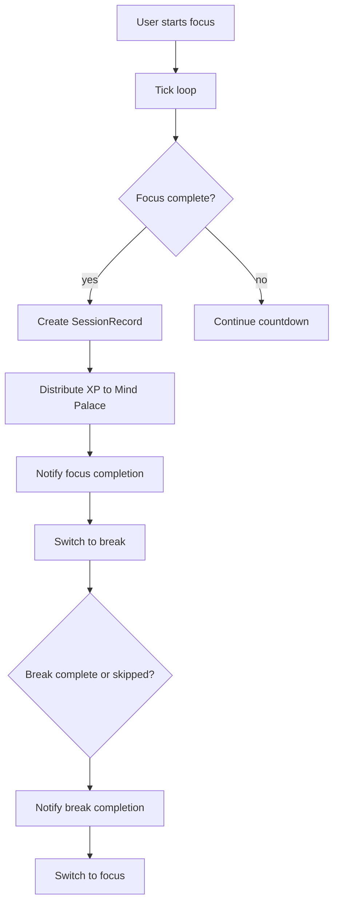

# Business Rules

This document is the source of truth for product behavior in Neural Architect.
It describes how Pomodoro flow, session lifecycle, and Mind Palace progression work today.

## Scope and Intent

- Define runtime rules for timer phases, transitions, and reset semantics.
- Define what is persisted as a session and what is intentionally excluded.
- Define XP attribution strategy for Mind Palace neurons.
- Capture edge cases and invariants used to keep state consistent.
- Document client-side trust boundaries for persistence and integrity.

## Pomodoro Core Rules

### Phases

- The timer has exactly two normalized phases: `focus` and `break`.
- Legacy persisted values like `shortBreak` and `longBreak` are normalized to `break` on hydration.
- Phase duration is resolved from config:
  - `focus` -> `config.focusInterval`
  - `break` -> `config.breakInterval`

### Start, Pause, Resume

- `start` only activates a run when the timer is neither running nor paused.
- `pause` is valid only while running; it records `pausedAt`.
- `resume` is valid only while paused; it shifts `startedAt` by pause duration so elapsed time stays accurate.

### Tick and Completion

- `tick` is ignored unless the timer is running and has a valid `startedAt`.
- Remaining time is calculated from wall-clock elapsed time, not decremented blindly.
- When remaining time reaches `0`, the current phase completes immediately.

### Transitions and Manual Next Phase

- Completing a phase always transitions to the opposite phase:
  - `focus` -> `break`
  - `break` -> `focus`
- `skipBreak` acts as a manual "next phase" only while currently in `break`; it triggers break completion and moves to `focus`.
- Calling `skipBreak` in `focus` does nothing.

### Reset Behavior

- `requestReset` only opens a pending-reset state (`resetPending = true`).
- `confirmReset` resets remaining time to the full current phase duration and clears run state.
- `cancelReset` only clears the pending-reset flag.

## Session Lifecycle Rules

### What Creates a Session Record

- Only completed `focus` phases create a `SessionRecord`.
- Completed `break` phases never create a session record.
- Session IDs are generated at completion time.

### Recorded Session Fields

Every recorded focus session includes:

- `id`
- `category` (from current timer config)
- `tagIds` (from current timer config)
- `phase` (`focus`)
- `durationSeconds` (full configured focus duration, not partial elapsed)
- `completedAt` (ISO timestamp)
- `xpEarned`

### XP Value on Session

- Session XP is calculated as `round(calculateReward(durationMinutes, 1))`.
- Current reward formula is `durationMinutes * 10 * multiplier`, so with multiplier `1`:
  - `xpEarned = round((durationSeconds / 60) * 10)`

### What Is Intentionally Not Recorded

- No partial-progress session record is written for interrupted or reset focus runs.
- No break-phase completion is stored in session history.

## Gamification Rules (Mind Palace)

### Level Progression Reference

- Neuron level is derived from cumulative XP using the evolution curve in `calculateLevel`.
- XP-to-next-level uses `floor(100 * level ^ 1.5)`.

### XP Attribution Strategy

The XP distribution order is strict:

1. If one or more tags exist, distribute all XP across tag neurons.
2. If no tags exist, try category fallback neuron.
3. If category is `custom`, skip category fallback entirely.

### Tags-First Distribution

- Total XP is split across all `tagIds`.
- Each tag receives `floor(totalXp / tagCount)`, with remainder distributed one-by-one from first tag onward.
- Tag neuron labels are derived from tag IDs if no neuron already exists.

### Category Fallback Behavior

- Category fallback applies only when `tagIds` is empty and category is not `custom`.
- Category neuron IDs use `cat:<category>` and labels are fixed (`Work`, `Study`, `Read`).
- For `custom` category with no tags, no neuron receives XP.

### Safe-Place Mapping Concept

- Categories and tags map to stable neuron identities that represent safe places in the Mind Palace.
- Repeated completions accumulate XP into the same neuron identity, driving level growth over time.

## Edge Cases and Invariants

- Non-finite or non-positive XP values are ignored by XP distribution.
- Rehydration always clears active run flags (`isRunning`, `isPaused`, `startedAt`, `pausedAt`, `resetPending`) to avoid stale runtime continuation.
- Config normalization enforces:
  - positive finite intervals
  - valid known categories
  - `activeTags` filtered to strings only
- Updating config or manually changing phase resets active run state by design.
- On phase completion, phase notification is always emitted; session recording remains focus-only.

## Security and Data Integrity Notes

- Persistence is client-side (`localStorage`) and therefore user-tamperable.
- Stored JSON is parsed defensively; invalid JSON is discarded and removed.
- This project currently has no server-authoritative validation for session or XP integrity.
- Treat all persisted timer/session/palace values as convenience state, not trusted proof.

## End-to-End Flow

## Code Reference Index

| Rule Area | Primary Implementation References |
| --- | --- |
| Timer phases, transitions, start/pause/resume/reset, skip-break | `src/stores/timerStore.ts`, `src/constants/timer.ts` |
| Focus-only session creation and XP value at completion | `src/stores/timerStore.ts`, `src/utils/rewards.ts` |
| Store integration boundary (`timer -> session + palace + notifications`) | `src/stores/setup.ts` |
| Session persistence model (records/tags/order) | `src/stores/sessionStore.ts` |
| Mind Palace XP distribution (tags-first, fallback, custom handling) | `src/stores/palaceStore.ts` |
| Level progression curve and level calculation | `src/constants/evolution.ts`, `src/stores/palaceStore.ts` |
| Storage parsing and client-side persistence boundary | `src/stores/setup.ts` |
| Neuron popover and click-to-select interaction | `src/components/palace/NeuronPopover.tsx`, `NeuronNode.tsx`, `NeuronMap.tsx` |
| XP toast display and dispatch wiring | `src/components/palace/XpToast.tsx`, `src/stores/setup.ts` |
| Background evolution tiers (CSS overlays based on highest neuron level) | `src/components/palace/BackgroundLayer.tsx`, `src/constants/evolution.ts`, `src/index.css` |
| System flow overview view | `src/components/palace/SystemFlowView.tsx` |
| Type definitions for tracking fields and activity log | `src/types/palace.ts` |

## Gamification Cohesion Features

### Neuron Tracking Fields

Each `NeuronState` now tracks two additional fields:

- `lastXpGained` — the amount of XP the most recent session contributed to this neuron. Reset to `0` after rehydration if absent.
- `lastLeveledUpAt` — ISO timestamp of the most recent level-up for this neuron. `null` if never leveled up, or after rehydration if absent.

### XP Activity Log

The MindPalaceState includes an `xpActivityLog: XpActivityEntry[]` array:

- Each `XpActivityEntry` records who received XP, how much, from what source (tag/category), whether a level-up occurred, and when.
- The log is capped at **50 entries** (oldest entries are dropped first).
- Rehydration initializes `xpActivityLog` to `[]` if missing.

### XP Toast

After a focus session completes:

- `distributeXp` returns `XpActivityEntry[]` for the entries created.
- If entries exist, a toast appears in the bottom-left corner showing the XP breakdown per neuron.
- The toast auto-dismisses after 6 seconds and can be dismissed early by clicking the close button.
- The toast includes a "View in Mind Palace" link that navigates to the palace view.
- Maximum 5 tag lines shown; additional entries are summarized as "and N more...".
- Level-up events are marked with a star (✦) indicator.

### Neuron Popover

Clicking a neuron node in the NeuronMap opens a popover anchored to that node:

- Shows the neuron label and level badge (color-coded by tier).
- Displays a progress bar showing current XP vs. XP needed for next level.
- Shows the last XP gained and, if applicable, the relative time since the last level-up.
- Only one popover can be open at a time. Clicking outside or pressing Escape closes it.

### Background Evolution

The Mind Palace background layer now includes CSS-driven visual evolution based on the user's highest-level neuron:

- `getProgressTier(highestLevel: number)` returns a tier from 1 to 5.
- The tier is applied as a CSS class `palace-bg--tier-{n}` on the background element.
- Each tier adds a subtle colored overlay via `::after` pseudo-element:
  - Tier 1 (levels 1–4): Default — no overlay.
  - Tier 2 (levels 5–9): Green tint.
  - Tier 3 (levels 10–14): Purple tint.
  - Tier 4 (levels 15–19): Amber tint.
  - Tier 5 (levels 20+): Dual-color pink-indigo tint.
- All overlays are subtle (opacity 0.08–0.12) and use pure CSS — no new images required.

### System Flow View

A third application view ("System Flow") provides an educational overview of the gamification system:

- Single scrolling page with connected step cards.
- Step 1: "Choose Your Session" — shows current category and tags.
- Step 2: "Complete a Focus Session" — shows session duration and XP earned.
- Step 3: "XP Finds Its Home" — flow diagram showing how tags/category map to neurons, with current neuron levels.
- Step 4: "Neurons Grow" — neuron card with progress bar showing level-up mechanics.
- Footer: "Your Progress" — total XP, unlocked neuron count, highest level.
- All data reflects the user's current config in real time.

### Navigation Updates

- `AppView` type now includes `'system'` in addition to `'timer'` and `'palace'`.
- ViewNavigation has three tabs: Timer, Mind Palace, and System Flow.
- Grid layout adjusted from `grid-cols-2` to `grid-cols-3`.
